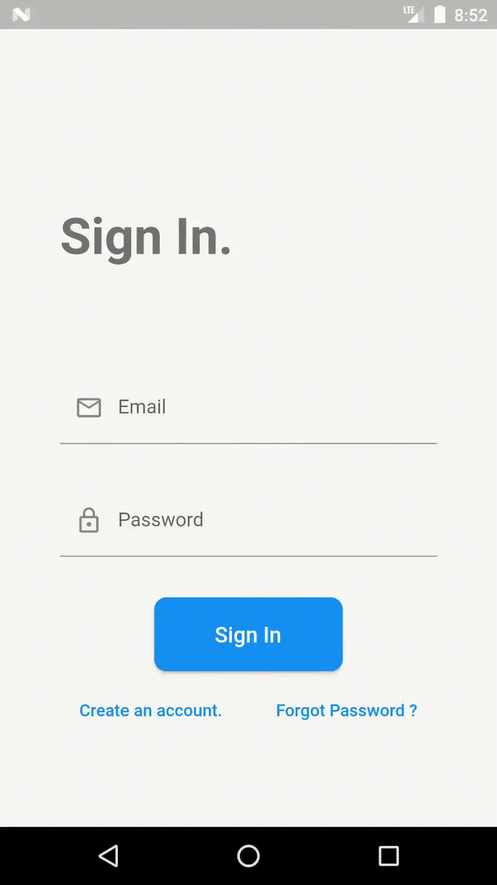
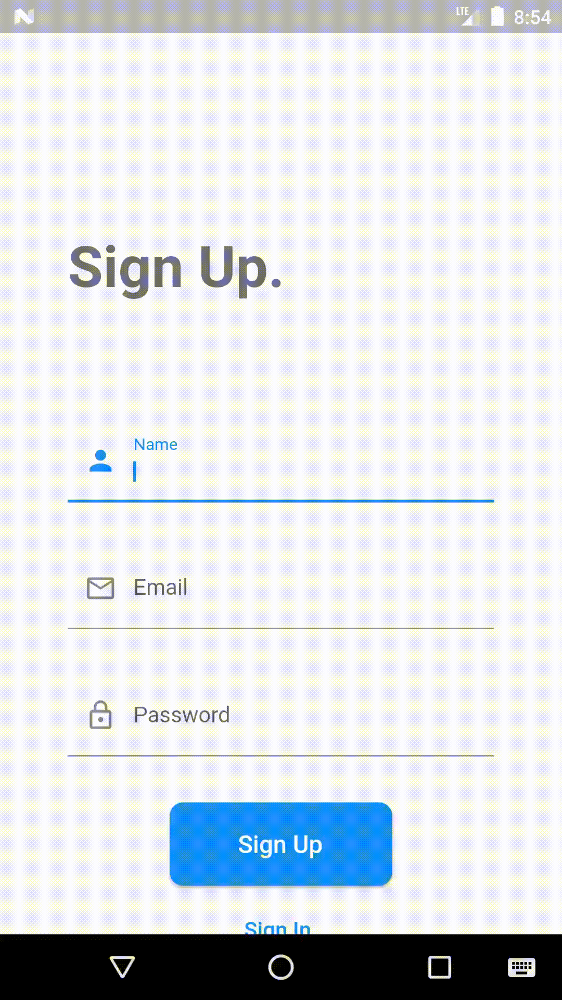
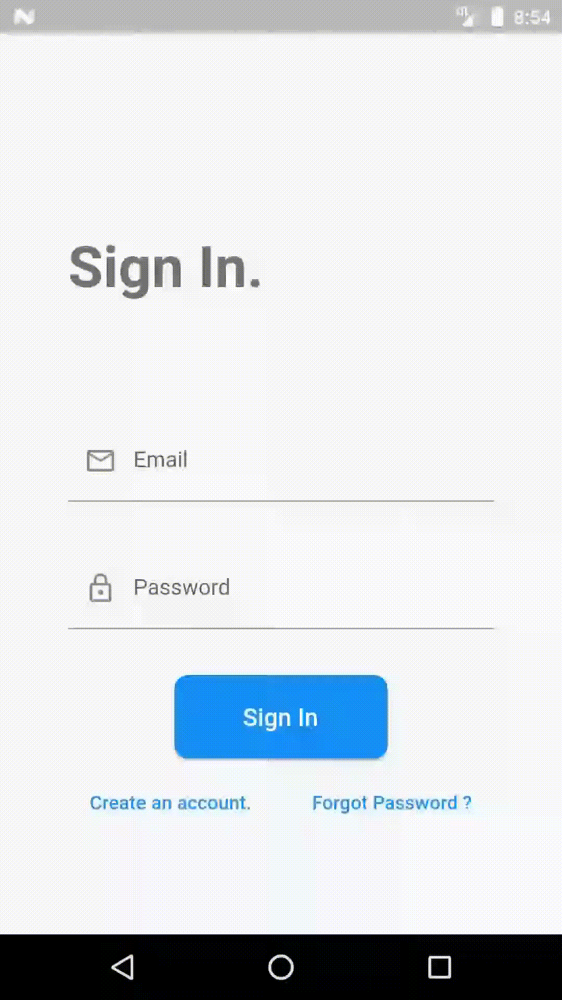

# Firebase-authentication

This project is an example of Firebase authentication in a Flutter.
This project shows how to implement a full authentication flow in Flutter using Email/Password and Google authentication.

It aims to be a reference implementation. Think of it as "authentication done right".

## Project goals
This project shows how to:

- Sign up with an email and password
- Sign in with that email and password
- Verify email
- Reset password
- Sign up with Google authentication
- Sign in with Google authentication
- Use appropriate state management techniques to separate UI, logic, and Firebase authentication code
- Handle errors and present user-friendly error messages
- Write production-ready code following best practices

Feel free to use this in your own projects. 😉
```
NOTE: This project will be kept up to date with the latest packages and Flutter version.
```

## Configuring your project
- After getting a project from GitHub run `flutter pub upgrade` to get latest dependencies
- Next run `flutterfire configure` to create `firebase` project and associate your Flutter app with Firebase project. This will also add `google-services.json` and `firebase-options.dart` files to your project. If you haven't configured Firebase before follow these [instructions](https://firebase.google.com/docs/flutter/setup?platform=android) to configure Firebase SDK. Note that there are a lot of problems with stand alone installation on Windows, you are better off using `npm` approach even though it is a little more diffcult to configure
- For Google authentication you have to add your [SHA certificate fingerprint](https://support.google.com/firebase/answer/9137403?hl=en) to your project in Firebase console. In dev, use below command to get your dev certificate fingerprints (SHA1 and SHA256) and paste them into Firebase console undr project settings:
`keytool -list -v -keystore "C:\Users\YourUserName\.android\debug.keystore" -alias androiddebugkey -storepass android -keypass android`
- In `Firebase Console` add Authentication to your project ad enable email/password authentication. Also, add another provider and configure Google authentication method. Run `flutterfire configure` again (you have to do this after making changes in the console)

- You should now be able to run the app

## Platforms supported
- ✔ Android
- ✔ web
- ❌ windows

## Preview
**Sign-in** 
<br/><br/>


**Sign-up** 
<br/><br/>


**Forgot password** 
<br/><br/>

<br/>

**Sign-in**


**Sign-Up**


**Forgot-Password**


**Home**


## Features and Plugins used
- ✔ Null safety
- ✔ Firebase
- ✔ firebase_core
- ✔ firebase_auth1
- ✔ provider


### Authentication features

- ✔ Email & Password Sign In
- ✔ Email & Password Sign Up
- ✔ Reset Password
- ✔ Verify Email
- ✔ Google authenticaton

## Application features

### Choose provider page

- ✔ Select between email/password and Google authnticaton

### Sign-in Page

- ✔ Form to enter email and password for signing-in the user.
- ✔ Button to toggle sign-up view.
- ✔ Button to navigate to forgot password page.

### Sign-up Page

- ✔ Form to enter a name, email, and password for signing up the user.
- ✔ Button to toggle sign-in view.

### Forgot Password Page

- ✔ Form to enter email for resetting the password.
- ✔ Button to navigate to the sign-in page.


### Features to add
- Mobile number authentication 
- signin/signup via facebook
- signin/signup using twitter 
- signin/signup using github

#### Made with ❤ by [@nittinsharma37](https://github.com/nittinsharma37)
## License
[MIT](https://choosealicense.com/licenses/mit/)
