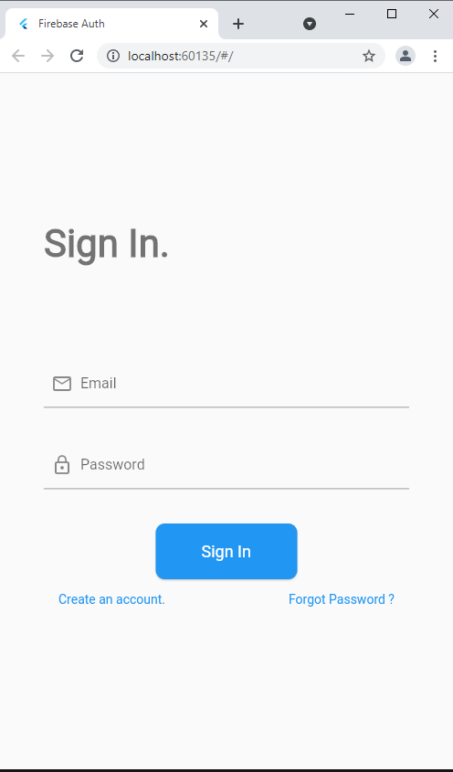
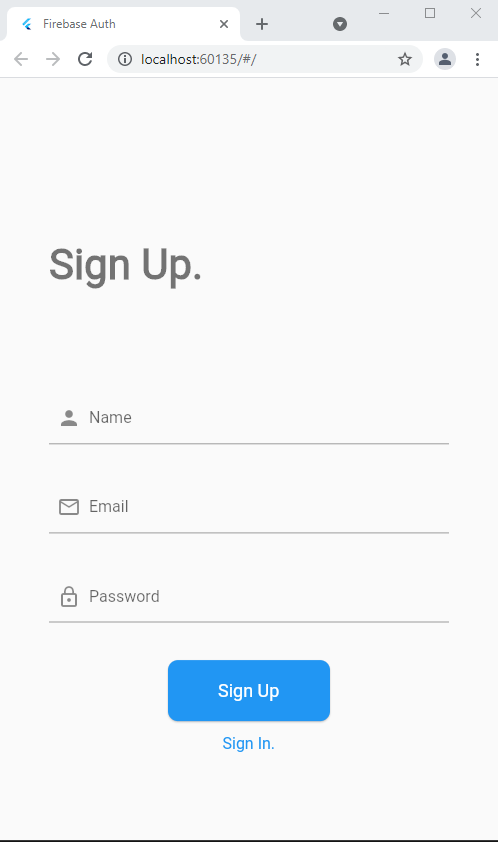
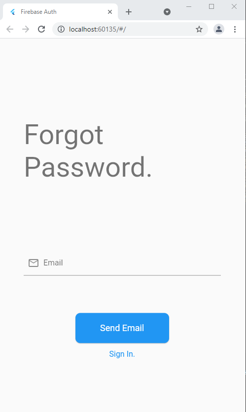
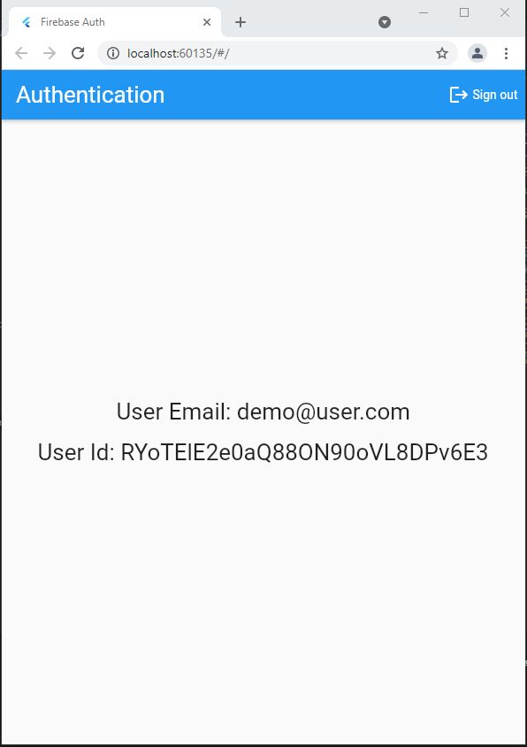

# Firebase-authentication

This project is an example of Firebase authentication in a flutter.
This project shows how to implement a full authentication flow in Flutter, using sign Up with email and password, sign in with email and password, and reset password.

It aims to be a reference implementation. Think of it as "authentication done right".

## Project goals
This project shows how to:

- Sign up with an email and password.
- Sign in with that email and password.
- Reset password.
- use appropriate state management techniques to separate UI, logic, and Firebase authentication code
- handle errors and present user-friendly error messages
- write production-ready code following best practices

Feel free to use this in your own projects. 😉
```bash
NOTE: This project will be kept up to date with the latest packages and Flutter version._
```
## Platforms supported
- ✔ Android
- ✔ web
- ❌ windows

## Preview
**Sign-in**


**Sign-in**



**Sign-Up**




**Forgot-Password**



**Home**



## Features and Plugins used
- ✔ Null safety
- ✔ Firebase
- ✔ firebase_core: ^1.6.0
- ✔ firebase_auth: ^3.1.1
- ✔ provider: ^6.0.0


### Authentication features

- ✔ Email & Password Sign In.
- ✔ Email & Password Sign Up.
- ✔ Reset Password.

## Application features

### Sign-in Page

- ✔ Form to enter email and password for signing-in the user.
- ✔ Button to toggle sign-up view.
- ✔ Button to navigate to forgot password page.

### Sign-up Page

- ✔ Form to enter a name, email, and password for signing up the user.
- ✔ Button to toggle sign-in view.

### Forgot Password Page

- ✔ Form to enter email for resetting the password.
- ✔ Button to navigate to the sign-in page.

#### Made with ❤ by [@nittinsharma37](https://github.com/nittinsharma37)
## License
[MIT](https://choosealicense.com/licenses/mit/)